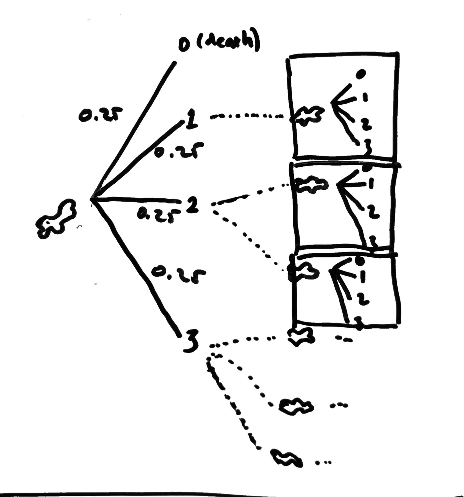

# Amoeba Population

## Question

Hi,

A population of amoebas starts with 1. After a single period, assume the amoeba can divide into 1, 2, 3, or 0 (it can die) with equal probability. What is the probability that the entire population dies out eventually?

*Source:* [interviewqs](interviewqs.com)

## Solution

### Explanation

We want to get the probability that the entire population of amoeba dies out eventually. Look at the probability tree above. There are four chances that an amoeba will divide after a single period.

Let's called  as event that the entire population of amoeba dies and =p,\text{where}0\leq&space;p\leq&space;1) is the probability of it. If all of these events are independent then any generation have the same chance to divide as the first.

We have 25% chance of amoeba dies after a single period. This added  on .

Another 25% chance of amoeba is not divided (still single). The probability of the entire next generation dies is .

Another 25% chance of amoeba divided into two. Because now we have two amoebas, the entire next generation dies if both amoebas dies. The probability of the entire next generation dies is . Using the same logic, if amoeba divided into three have the probability of the entire next generation dies .

Let's sum all chances to get .

Normalize above equation, we get

Solving above equation, we get

Because of  and we know that there is a probability that amoebas don't die, then . Thus we get .

So the probability of entire population of amoeba dies out eventually is .
